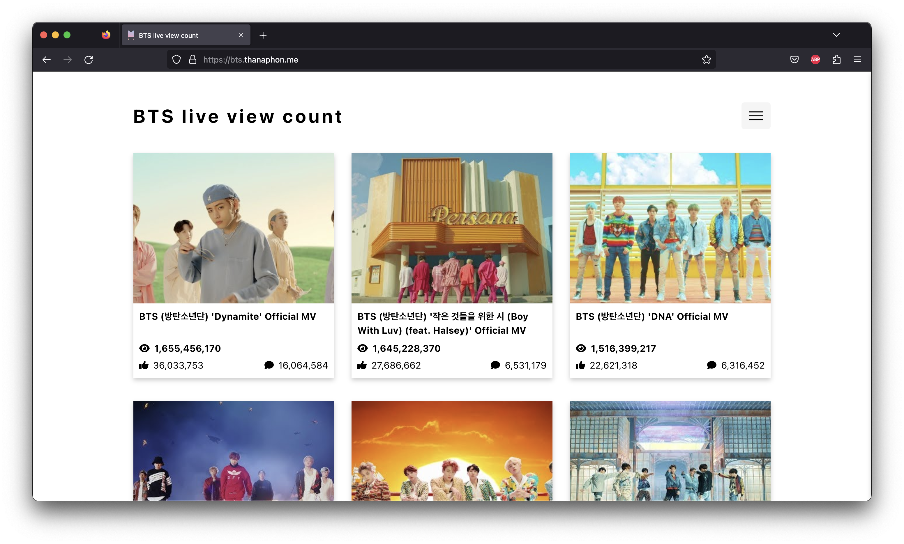

# BTS live view count

### Description

BTS live view count is a monolith web application for showing view, and statistics of BTS (Korean boy group) music video in real time.

### Tech Stack

- **Front-end**
  - React
  - Typescript
  - Vite
- **Back-end**
  - NodeJS with NestJS
  - Typescript
- **Database**
  - MongoDB Atlas
- **External API**
  - Youtube Data API V3
- **Infrastructure**
  - Google cloud run
  - Google cloud scheduler

### System Architecture

